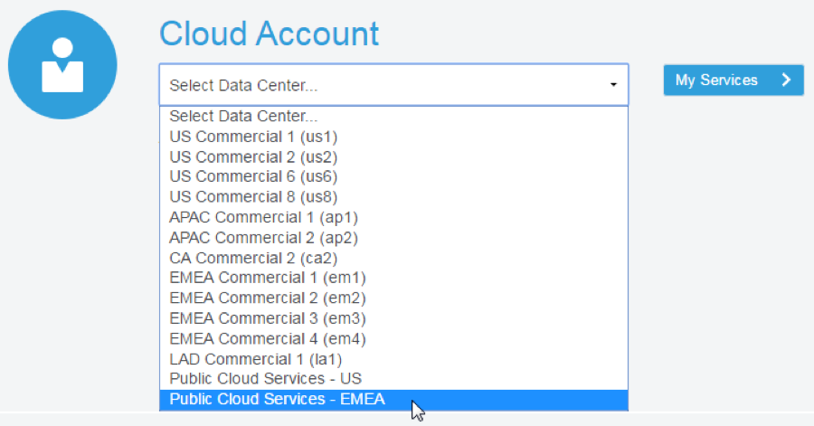

  

##Introduction

This is the first of several labs that are part of the **Oracle Public Cloud DevOps Cloud Native Microservices workshop.** This workshop will walk you through the Software Development Lifecycle (SDLC) for a Cloud Native project that will create and use several Microservices.

You will take on 3 Personas during the workshop. The **Project Manager Persona** will create the projects, add tasks and features to be worked on, and assign tasks to developers.  The Project Manager will then start the initial sprint. The Java Developer persona will develop a new twitter feed service that will allow for retrieval and filtering of twitter data. The **JavaScript Developer** persona will develop a new Twitter Marketing UI that will display the twitter data to allow for analysis.  During the workshop, you will get exposure to Oracle Developer Cloud Service and Oracle Application Container Cloud Service.

Please direct comments to: Dennis Foley (dennis.foley@oracle.com)

##Objectives
- Create Initial Project
    - Add Users to Project
- Create Product Issues
    - Create Issues for Twitter Feed Microservice
    - Create Issues for Twitter Feed Marketing UI
- Create Agile Board and initial Sprint
- Add Issues to Sprint

##Required Artifacts
- The following lab requires an Oracle Public Cloud account that will be supplied by your instructor.


#Create Twitter Feed Marketing Project

##Create Developer Cloud Service Project

###Step 1: Login to your Oracle Cloud Account
- From any browser, go to the URL:
    `https://cloud.oracle.com`

- click **Sign In** in the upper right hand corner of the browser

    

- **IMPORTANT** - Under my services, *ask your instructor* which **Region** to select from the drop down list, and click on the **My Services** button.

    

- Enter your identity domain and click **Go**
**NOTE:** The **Identity Domain, User Name** and **Password** values will be given to you by the instructor.
    
    
- You will be presented with a Dashboard displaying the various cloud services available to this account. 

    
    
- If all of your services are not visible, **click** on the **Customize Dashboard**, you can add services to the dashboard by clicking **Show.** If you do not want to see a specific service click **Hide**

    
    
###Step 2: Login to Developer Cloud Service

Oracle Developer Cloud Service provides a complete development platform that streamlines team development processes and automates software delivery. The integrated platform includes an issue tracking system, agile development dashboards, code versioning and review platform, continuous integration and delivery automation, as well as team collaboration features such as wikis and live activity stream. With a rich web based dashboard and integration with popular development tools, Oracle Developer Cloud Service helps deliver better applications faster.

- From the Cloud UI dashboard click on the **Developer** service. In our example, the Developer Cloud Service is named **developer99019**.

    
    
- The Service Details page gives you a quick glance of the service status overview.

    
    
- Click **Open Service Console** for the Oracle Developer Cloud Service. The Service Console will list all projects for which you are currently a member.

    

###Step 3: Create Developer Cloud Service Project

- Click **New Project* to start the project create wizard.
- On Details screen enter the following data and click on **Next**.

    **Name =** `Twitter Feed Marketing Project`

    **Description =** `Project to gather and analyze twitter data`
    
**Note:** A Private project will only be seen by you. A Shared project will be seen by all Developer Cloud users. In either case, users need to be added to a project in order to interact with the project.


- Leave default template set to **Empty Project** and click **Next**


- Select your **Wiki Markup** preference to **MARKDOWN** and click **Finish**.


- The Project Creation will take about 1 minute.


- You now have a new project, in which you can manage your software development.


##Add Team Members (Owners) to the Project

**Note:** As previously mentioned, **_if you are not allowed to have multiple users in your Corporate or Trial accounts, you will skip step 4._** When in subsequent steps/labs you are asked to log in as different users responsible for different roles, you will physically perform the tasks as the same user, but you should mentally assume the role of a different persona. 

###Step 4: Add Team Owners to the Project

- Click on the **Team** icon  found on the far right side of the window.
- To add new Team Members, click **New Member**


- Set the Role to **Owner**, and enter the Username **bala.gupta**, and then click **Add**

- Repeat the process for Username **john.dunbar**. When completed your team should consist of 3 members.


#Create Product Issues

##Create Issues for Twitter Feed Microservice

In this step you are still connected in the logica role of the Project Manager, Lisa Jones

###Step 5: Create and Issue for the initial GIT Repository Creation

- Click **Issues** on left hand navigation panel to display the Track Issues page.

    

- Click **New Issue**. Enter the following data in the New Issue page and click **Create Issue**. 

    **Note:** no matter who you assign as the task “physical” owner, for the sake of this workshop, Bala Gupta will be the “logical” owner. The same concept holds true for other assignments made in this lab.

    **Summary:**
    `Create Initial GIT Repository for Twitter Feed Service`
    
    **Description:**
    `Create Initial GIT Repository for Twitter Feed Service`
    
    **Type =** `Task`
    **Owner =** `Bala Gupta (or you, if another user is not available)`
    **Story Points** = `1`
    
    ```javascript
    // Example
    var s = "JavaScript syntax highlighting";
    alert(s);
    ```
 
Note: Story point is an arbitrary measure used by Scrum teams. This is used to measure the effort required to implement a story. To learn more: `https://agilefaq.wordpress.com/2007/11/13/what-is-a-story-point/`


**_Start Here_**
    
#Create Agile Board

##Create Agile Board and Initial Sprint

Before you start using the Agile methodology in Oracle Developer Cloud Service, it is important that you know the following key components of the Agile page.

- **Board** – A Board is used to display and update issues of the project. When you create a Board, you associate it with an Issue Query. The Board shows Issues returned by the Query.
You can either use a Board created by a team member, or create your own Board. You can create as many Boards as you like.
- **Sprint** – A Sprint is a short duration (usually, a week or two) during which your team members try to implement a product component.
You add the product component related issues to a Sprint. When you start working on a product component, you start (or activate) the related Sprints. To update issues using a Sprint, you must first activate the Sprint and add the Sprint to the Active Sprints view.
- **Backlog view** – Lists all Issues returned by the Board’s Query. The view also displays all active and inactive Sprints of the Board, and the sprints from other Boards that contain Issues matching the Board’s Query.
Each Sprint lists issues that are added to it. The Backlog section (the last section of the Backlog page) lists all open issues that are not part of any Sprint yet. The Backlog view does not show the resolved and closed Issues.
- **Active Sprints view** – Lists all active Sprints of the Board and enables you to update an Issue status simply by dragging and dropping it to the respective status columns.
- **Reports view** – select the Burndown Chart tab to display the amount of work left to do in a Sprint or use the Sprint Report tab to list open and completed Issues of a Sprint.

