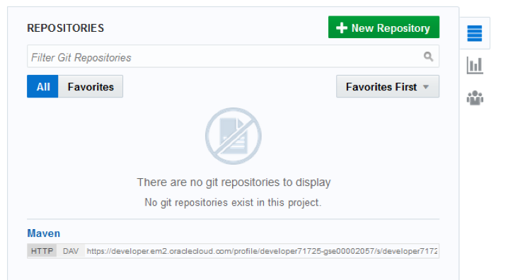
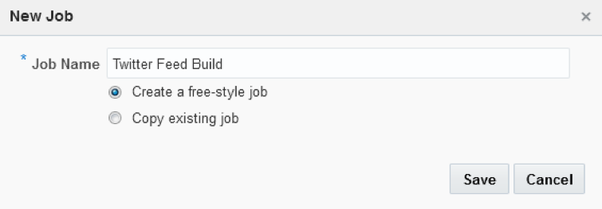
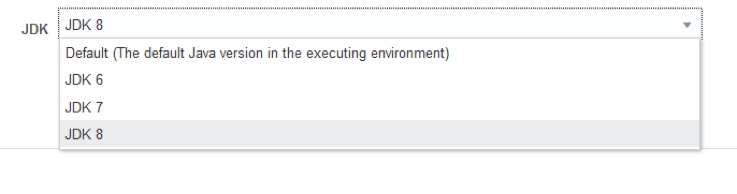
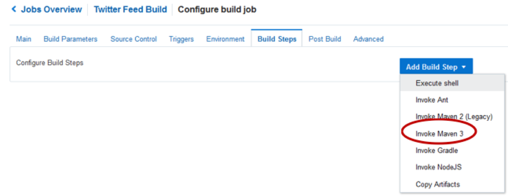
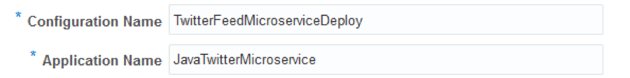
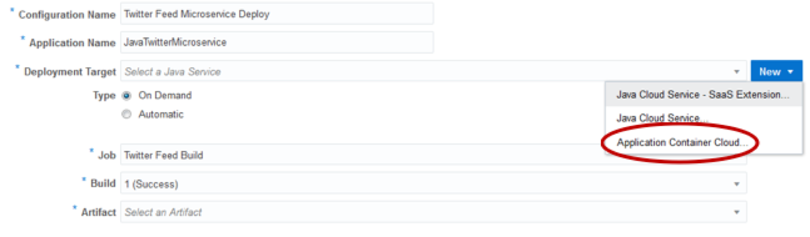
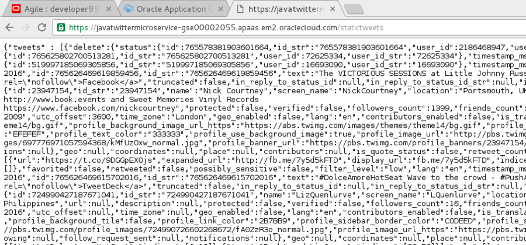
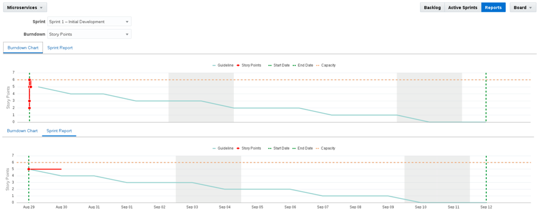

  
Update: January 28, 2017

## Introduction

This is the first of several labs that are part of the **Oracle Public Cloud DevOps Cloud Native Microservices workshop.** This workshop will walk you through the Software Development Lifecycle (SDLC) for a Cloud Native project that will create and use several Microservices.

In the first lab (100), the Project Manager created a new project in the Developer Cloud Service, added team members to the project, and created and assigned tasks to the developers of this application. In this lab, you will assume the persona of the Java developer, who will be tasked with creating several microservices that will supply data to any required front-end or analytics components (one of which you will build in the following lab, lab 300).

Please direct comments to: Dennis Foley (dennis.foley@oracle.com)

## Objectives

- Access Developer Cloud Service
- Import Code from external Git Repository
- Import Project into Eclipse
- Build and Deploy project using Developer Cloud Service and Oracle Application Container Cloud Service

## Required Artifacts

- The following lab requires an Oracle Public Cloud account that will be supplied by your instructor. You will need to download and install latest version of Eclipse

# Create Initial Static Twitter Feed Service

## Explore Developer Cloud Service

### Step 1: Login to your Oracle Cloud account as Bala.Gupta

- If you just completed lab 100, or if you are still logged in as Lisa.Jones, you will need to first sign out before continuing this lab. Sign out by clicking on the user’s name (lisa.jones) at the top right corner of the screen, then selecting Sign Out from the dropdown menu.

      

- Now we can login again. From any browser, **go to the following URL**:
https://cloud.oracle.com

- Click **Sign In** in the upper right hand corner of the browser.

      

- **IMPORTANT** - Under My Services, ask ***your instructor*** which **Region** to select from the drop down list, and **click** on the **My Services** button.

      

- Enter your identity domain and click **Go**

  ***NOTE***: the **Identity Domain, User Name** and **Password** values will be given to you from your instructor.

      

- Once your Identity Domain is set, enter your **User Name** and **Password** and click **Sign In**

  **NOTE**: For the first part of this lab you will be acting as the Java Developer ***Bala Gupta***. As with the previous lab, if you are not able to support multiple users, login as a supported user, and assume the “logical” identify of Bala Gupta - the Java Developer.

      

- Once connected, you will be presented with a Dashboard displaying the various cloud services available to this account. Note: Based on your browser cookie settings, **it’s possible that once connected you will placed into the Developer Cloud Service dashboard**, and will not need to complete the next few tasks that were performed automatically.

      

### Step 2:	Login to Developer Cloud Service

Oracle Developer Cloud Service provides a complete development platform that streamlines team development processes and automates software delivery. The integrated platform includes issue tracking system, agile development dashboards, code versioning and code review platform, continuous integration and delivery automation, as well as team collaboration features such as wikis and live activity stream. With a rich web based dashboard and integration with popular development tools, Oracle Developer Cloud Service helps deliver better applications faster.

- From Cloud UI dashboard click on the **Developer** service. In this example the Developer Cloud Service is named **developer99019**.

    

- The Service Details page gives you a quick glance of the service status. Click **Open Service Console** for the Oracle Developer Cloud Service

    

- The Service Console will list all projects that you are currently a member of. Click **Twitter Feed Marketing Project** to access the project

    

- The Twitter Feed Marketing Project dashboard will be displayed.

    

###Step 3:	Review Agile Board

- Within the **Twitter Feed Marketing Project**, click on **Agile** found on the left hand navigation.

    

###Step 4:	Show Microservices Board

- If the **Microservices** list is not displayed as shown below, then click on the **Board Dropdown**, select **All**, and click on **Microservices**.
    
      

### Step 5: Display the Active Sprint

- Click on the **Microservices** Board **Active Sprint**

      

## Create Initial Git Repository

### Step 6: Create Initial Git Repository

To begin development on our Twitter feed microservices, we could start coding from scratch. However, prior to the formal kickoff of this project, you have already started doing some proof-of-concept development outside of the Developer Cloud Service in order to assess the feasibility of your assignment. You want to bring that existing code into the Developer Cloud Service as a starting point for your microservices. You will do that by cloning your external GIT repository into the Developer Cloud Service. Your first step will be to accept your task using the agile board.

- Drag and drop **Task1 - Create Initial GIT Repository for Twitter Feed Service** into the **In Progress** swim-lane.  

    

- Click **OK** on the Change Progress popup

    

    

- In the left hand navigation panel, click **Project**

- Click on **New Repository** to create a new Git Repository.

    

- In the New Repository wizard enter the following information and click **Create**.

    **Name:** `TwitterFeedMicroservice`

    **Description:** `Twitter Feed Microservice`

    **Initial content:** `Import existing repository`

    **Enter the URL:** `https://github.com/oraclenassolutionengineering/TwitterFeed.git`

      

- You have now created a new GIT repository based on an existing repository.

    

##Create Default Build and Deployment Process

### Step 7:	Create Default Build Process

Now that we have the source code in our managed GIT repository, we need to create a build process that will be triggered whenever a commit is made to the master branch. We will set up a Maven build process in this section.

- On navigation panel click **Build** to access the build page and click **New Job**.

    

- In the New Job popup enter **Twitter Feed Build** for the Job Name, and then click **Save**.

    

- You are now placed into the job configuration screen.

      

- On the Main tab of the Configure Build screen change the **JDK** drop down to **JDK8**.

      

- Click the **Source Contro**l tab. Click Git and select the **TwitterFeedMicroservice.git** from the drop down.

      

- Click the **Triggers** tab.

  **Select**: `Based on SCM polling schedule`

  **Schedule:** `*/1****`

  **Note:** The above expression results in the repository being polled every minute to check for any changes. If there are changes, the build will trigger.

    

- Click the **Build Steps** tab. Click **Add Build Step**, and select **Invoke Maven 3**.

    

- Change **Goals** to clean `assembly:assembly`

    

- Click the **Post Build** tab and complete the following:
  - Check **Archive the artifacts**.
  - Enter `**/target/*` for Files to Archive.  
  - Verify **GZIP** in the Compression Type.
  - Check **Publish JUnit test report**
  - Enter `**/target/surefire-reports/*.xml` for the Test Report XMLs. This will provide a report on the Test Scripts results for each build.

    

- Click **Save** to complete the configuration.

- Click the **Build Now** button to start the build immediately. Wait, as it may take 30 seconds or more, but the status will change to the following:

    

  **NOTE:** Once the build begins, it should take about approximately 1 to 2 minutes for the build to complete. Once complete, you will be able to see the number of successful test runs in the Test Result Trend section. Wait for the build to complete before continuing to the next step, as we need the build artifact to complete the deployment configuration.

- After the build begins, you can also click on the **Console Icon** to monitor the build log details.

    

### Step 8:	Create Default Deployment Process

Now that we have successfully built our project, we need to create a deployment configuration that will watch for stable builds and deploy them to a new Application Container Cloud Service instance for testing.

- On the navigation panel click **Deploy** to access the Deployment page. Click **New Configuration**.

    

- Enter the following data:

  **Configuration Name**: `TwitterFeedMicroserviceDeploy`

  **Application Name**: `JavaTwitterMicroservice`

    

- To the Right of Deployment Target, click **New** and select **Application Container Cloud**

    

- Enter the following data:
  - **Data Center**: `EMEA Commercial 2 – em2` ***(or your appropriate Data Center)***
  - **Identity Domain**: `<You Identity Domain>`
  - **Username**: `bala.gupta` **(or your appropriate username if running as single user)**
  - **Password**: `<Supplied Password>`

- Click **Test Connection**. If Successful, click **Use Connection**:

    

- Set the following Properties as follows:
  - **Runtime**: `Java`
  - **Subscription**: `Hourly`
  - **Job:** `Twitter Feed Build`
  - **Type:** `Automatic` and `Deploy stable builds only`
  - **Artifact:** `target/twitter-microservice-example-dist.zip`

    

- Click **Save**

    

- Click drop down and select **Start**

    

- Wait until the message **Starting application** changes to **Last deployment succeeded**

    

## Verify Twitter Feed Microservice deployment

### Step 9:	Change status to Verified

Now that we have successfully deployed the build artifact to the Application Container Cloud Service, we will update our agile board to reflect that status. Although the complexity of the next task (verification) is quite simple, we will still move the task to the “Verify Code” column before manually verifying the new functionality.

- On navigation panel click **Agile**, followed by clicking **Active Sprints**. Drag and drop **Task 1** from **In Progress** to the **Verify Code** column.

    

- In the Change Progress popup, click on **OK**

    

- The code is now ready for verification before moving to Completed

    

### Step 10:	Login to Oracle Application Container Cloud Service

- Return to the Developer Service Cloud Dashboard tab if it’s still available, then select the Dashboard icon to return to the Oracle Public Cloud Dashboard. Note: It’s possible that you may be required to once again login, if the session has expired.

    

- Once the Oracle Public Cloud **Dashboard** is displayed, click on the  

   menu to the right of the **Application Container** service. Then select **Open Service** Console

    

- On the Application Container Cloud Service (ACCS) Service Console you can view all the deployed applications, including our newly created **JavaTwitterMicroservice**. Click on the **URL**, and it will load a new browser tab

    

- Append `/statictweets` to the end of the URL in the browser, and press return (e.g.):
`https://javatwittermicroservice-.apaas.em2.oraclecloud.com/statictweets`

  Note: The URL should return a JSON array containing a Static Twitter feed. Note: If you desire to see a formatted view of the JSON, open a new tab and search Google for “JSONViewer chrome plugin” – After you install the Chrome Plugin and re-submit the URL, you will be able to view the JSON in a more readable format.

    

## Step 11:	Complete Task

We have now verified that the statictweets microservice has been deployed and functions properly. To finish up this part of the lab, we will mark the Issue as completed in our Sprint.

- Back in the Developer Cloud Service window, click **Agile**, followed by clicking Active Sprints.

- Drag and drop **Task 1** from **Verify Code** to **Completed**.

    

- In the Change Progress popup click **OK**.

    

- Your Sprint should now look like the following:

    

- You can also click on the **Reports** button and view your progress in the **Burndown Chart** and **Sprint Report**.

    

# Add Filter to Static Twitter Feed Service

Now that we have completed the import, build, deployment, and verification of our initial static twitter microservice, it is time to extend the project by adding a new microservice that allows us to dynamically filter the incoming tweets based on their contents. We will use the Eclipse IDE to clone the managed GIT repository to our local workstation, test the local copy, and add the filtering feature to the local copy. We will test the new feature in Eclipse, create a new code branch for it, and commit the branch. Then we will create a merge request and switch to the Project Manager persona to approve that request. We will also see how we can manage our agile task status directly from Eclipse.

## Clone Project to Eclipse IDE

### Step 12:	Load Eclipse IDE

- Right Click and select **Run** on the **Eclipse** Desktop Icon

    

- Once Eclipse loads, **close** the **Welcome Window** if it is visible.

    

### Step 13:	Create connection to Oracle Developer Cloud Service

- We will now create a connection to the Developer Cloud Service. To do this, first click on the menu options **Window -> Show View ->Other**  

    

- Enter `oracle` in the search field. Select **Oracle Cloud**, and click on **OK**.  

    

- Click on **Connect** in the Oracle Cloud tab

    

- Enter the following information:
  - **Identity Domain**: `<your identity domain>`
  - **User name**: `bala.gupta` (or your appropriate username, if running as single user)
  - **Password**: `<your Identity domain password>`
  - **Connection Name**: `OracleConnection`

    

- If prompted, enter and confirm a Master Password for the Eclipse Secure Storage.
  - In our example we use the **password:**  `oracle`. Press **OK**.

      

  - If prompted to enter a Password Hint, click on **No**

      

### Step 14:	Create a local clone of the repository

- **Expand Developer**, and then **double click** on **Twitter Feed Marketing Project** to activate the project.

    

- **Expand** the **Code**, and **double click** on the **Git Repo** [**TwitterFeedMicroservice.git**], to cause the Repo to be cloned locally.

    

- **Right Click** on the **TwitterFeedMicroservice** cloned repository and **click** on **Import Projects**.

    

- Keep the wizard defaults and **click** on **Next**

    

- Accept the Import defaults, and **click on Finish**

      

### Step 15:	Select the correct Java JDE

- **Click** on the **TwitterFeedMicroservice** Project, then from the **top menu**, select **Project > Properties**

    

- Select the **Java Build Path** option.

    

- **Click** on the **Libraries tab**, then select the **JRE System Library**. Next, **click** on the **Edit** button.

    

- **Click** on the **Installed JREs** button.

    

- **Select** the Standard VM, which in this case is **java-1.8.0-openjdk**. Then, **click** on **Edit**

    

- **Navigate** to **usr/java**, select **jdk1.8.0_102**, and **click** on **OK**

    

# continue conversion on page 36 of the 200 guide
