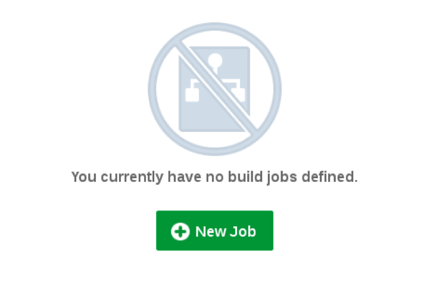

  
Update: January 28, 2017

## Introduction

This is the first of several labs that are part of the **Oracle Public Cloud DevOps Cloud Native Microservices workshop.** This workshop will walk you through the Software Development Lifecycle (SDLC) for a Cloud Native project that will create and use several Microservices.

In the first lab (100), the Project Manager created a new project in the Developer Cloud Service, added team members to the project, and created and assigned tasks to the developers of this application. In this lab, you will assume the persona of the Java developer, who will be tasked with creating several microservices that will supply data to any required front-end or analytics components (one of which you will build in the following lab, lab 300).

Please direct comments to: Dennis Foley (dennis.foley@oracle.com)

## Objectives

- Access Developer Cloud Service
- Import Code from external Git Repository
- Import Project into Eclipse
- Build and Deploy project using Developer Cloud Service and Oracle Application Container Cloud Service

## Required Artifacts

- The following lab requires an Oracle Public Cloud account that will be supplied by your instructor. You will need to download and install latest version of Eclipse

# Create Initial Static Twitter Feed Service

## Explore Developer Cloud Service

### Step 1: Login to your Oracle Cloud account as Bala.Gupta

- If you just completed lab 100, or if you are still logged in as Lisa.Jones, you will need to first sign out before continuing this lab. Sign out by clicking on the user’s name (lisa.jones) at the top right corner of the screen, then selecting Sign Out from the dropdown menu.

    

- Now we can login again. From any browser, **go to the following URL**:
https://cloud.oracle.com

- Click **Sign In** in the upper right hand corner of the browser.

    

- **IMPORTANT** - Under My Services, ask ***your instructor*** which **Region** to select from the drop down list, and **click** on the **My Services** button.

  

- Enter your identity domain and click **Go**

  ***NOTE***: the **Identity Domain, User Name** and **Password** values will be given to you from your instructor.

    

- Once your Identity Domain is set, enter your **User Name** and **Password** and click **Sign In**

  **NOTE**: For the first part of this lab you will be acting as the Java Developer ***Bala Gupta***. As with the previous lab, if you are not able to support multiple users, login as a supported user, and assume the “logical” identify of Bala Gupta - the Java Developer.

    

- Once connected, you will be presented with a Dashboard displaying the various cloud services available to this account. Note: Based on your browser cookie settings, **it’s possible that once connected you will placed into the Developer Cloud Service dashboard**, and will not need to complete the next few tasks that were performed automatically.

    

### Step 2:	Login to Developer Cloud Service

Oracle Developer Cloud Service provides a complete development platform that streamlines team development processes and automates software delivery. The integrated platform includes issue tracking system, agile development dashboards, code versioning and code review platform, continuous integration and delivery automation, as well as team collaboration features such as wikis and live activity stream. With a rich web based dashboard and integration with popular development tools, Oracle Developer Cloud Service helps deliver better applications faster.

- From Cloud UI dashboard click on the **Developer** service. In this example the Developer Cloud Service is named **developer99019**.

    

- The Service Details page gives you a quick glance of the service status. Click **Open Service Console** for the Oracle Developer Cloud Service

    

- The Service Console will list all projects that you are currently a member of. Click **Twitter Feed Marketing Project** to access the project

    

- The Twitter Feed Marketing Project dashboard will be displayed.

    

###Step 3:	Review Agile Board

- Within the **Twitter Feed Marketing Project**, click on **Agile** found on the left hand navigation.

    

###Step 4:	Show Microservices Board

- If the **Microservices** list is not displayed as shown below, then click on the **Board Dropdown**, select **All**, and click on **Microservices**.

  

### Step 5: Display the Active Sprint

- Click on the **Microservices** Board **Active Sprint**

  

## Create Initial Git Repository

### Step 6: Create Initial Git Repository

To begin development on our Twitter feed microservices, we could start coding from scratch. However, prior to the formal kickoff of this project, you have already started doing some proof-of-concept development outside of the Developer Cloud Service in order to assess the feasibility of your assignment. You want to bring that existing code into the Developer Cloud Service as a starting point for your microservices. You will do that by cloning your external GIT repository into the Developer Cloud Service. Your first step will be to accept your task using the agile board.

- Drag and drop **Task1 - Create Initial GIT Repository for Twitter Feed Service** into the **In Progress** swim-lane.  

    

- Click **OK** on the Change Progress popup

    

    

- In the left hand navigation panel, click **Project**

- Click on **New Repository** to create a new Git Repository.

    

- In the New Repository wizard enter the following information and click **Create**.

**Name:** `TwitterFeedMicroservice`

**Description:** `Twitter Feed Microservice`

**Initial content:** `Import existing repository`

**Enter the URL:** `https://github.com/oraclenassolutionengineering/TwitterFeed.git`

    

- You have now created a new GIT repository based on an existing repository.

    

##Create Default Build and Deployment Process

### Step 7:	Create Default Build Process

Now that we have the source code in our managed GIT repository, we need to create a build process that will be triggered whenever a commit is made to the master branch. We will set up a Maven build process in this section.

- On navigation panel click **Build** to access the build page and click **New Job**.

    
