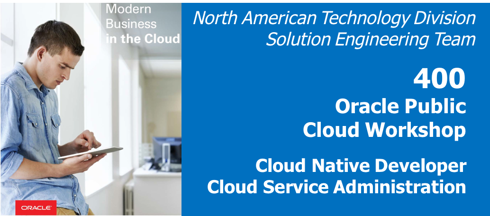
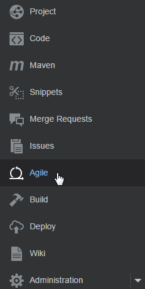
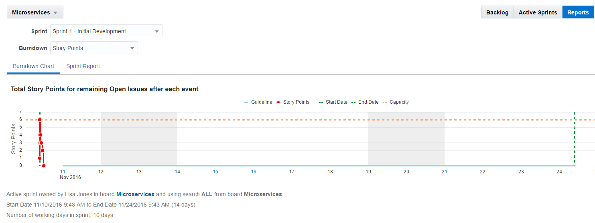
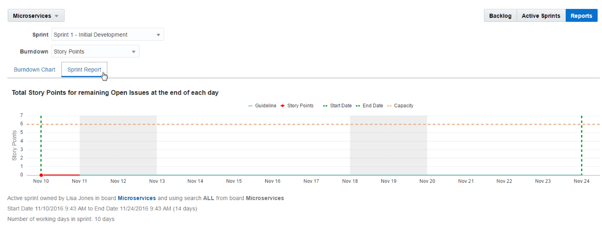
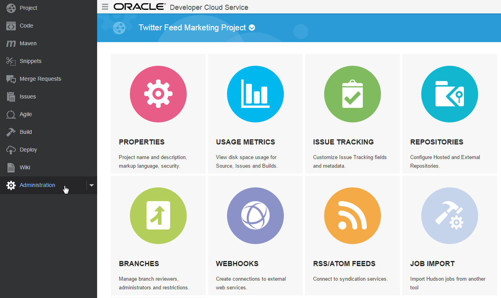
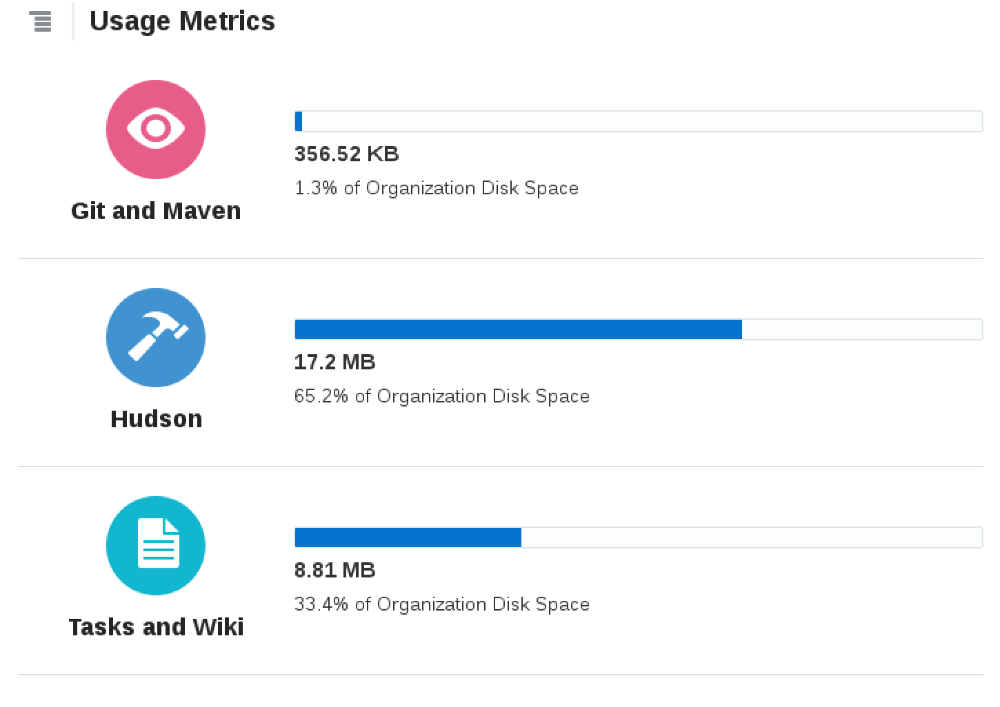
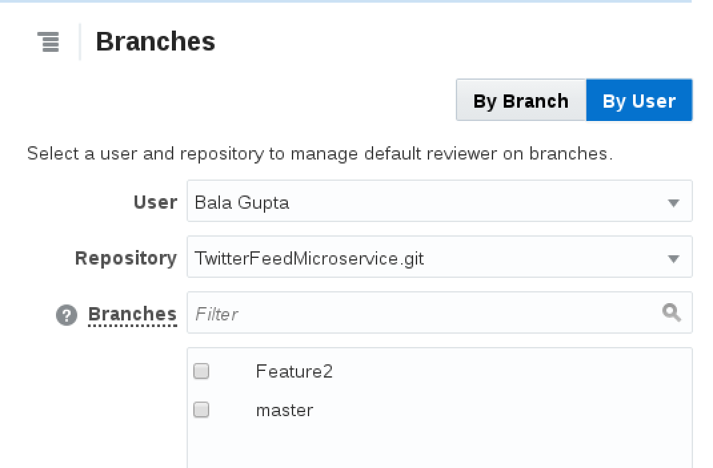

  
Update: Feburary 2, 2017

## Introduction

This is the fourth of several labs that are part of the **Oracle Public Cloud Cloud Native Microservices workshop**. This workshop will walk you through the Software Development Lifecycle (SDLC) for a Cloud Native project that will create and use several Microservices.

In this lab, Lisa Jones (The Project Manager) will complete the Sprint and view the Agile reports provided by the Oracle Developer Cloud Service

Please direct comments to: Dennis Foley (dennis.foley@oracle.com)

## Objectives
- Access Developer Cloud Service
- Complete Sprint
- Run Backlog and Sprint Reports
- Review Administrative Tasks

## Required Artifacts
- The following lab requires an Oracle Public Cloud account that will be supplied by your instructor.

# Close the Sprint

## Connect to the Develop Cloud Service

### **STEP 1**: Login to your Oracle Cloud Account

- If not already connected as the project manager **Lisa Jones**, sign in as Lisa Jones (or if running in a domain/account which supports only one user, logically change roles)

- As performed in labs, 100, 200 and 300, open to the **Developer Console**.

- Click on **Agile** on the Microservice Board.

    

- Click on the **Reports** Button and explore the **Burndown Chart**.

    

- Click on the **Sprint** report.

    

### **STEP 2**: Complete the Sprint

- Click on to the **Active Sprints** button, then click **Complete Sprint**.

- **Confirm** and **Complete** the Sprint

##Run Sprint Reports

### **STEP 3**: Run Sprint Reports

- Return to the **Reports** Page

    

- Review the Burndown Report by Story Points. Note: normally it would take several days to complete this project, and the report would provide information about the Burndown Rate per Day.

    

- Click on the **Sprint Report** tab. In this lab, the results will be skewed because the Sprint was completed in a single day. However, the dotted line shows the starting point, and the red line shows the current remaining points. Normally this would step down towards the end of the sprint.

    

# Project Administrative Features

## Review Administrative Features

### **STEP 3**: Review Administrative Options

- Click on **Administration** navigation to view the available administrative options. Click on the **Properties icon**.

    

- From this panel you are able to set the default properties for the Project. This is also the where the project can be deleted.

    

- Click on the Administration drop down to view the other Administration options. Select the **Usage Metrics**.

    

- The Usage Metrics will display the available storage allocation and usage for Git, Maven, Hudson, Tasks and the Wiki.

    

- From the Menu options list select **Issues Tracking** to view the options available for Issue configuration.

    

- From the Menu options list, select **Repositories**.

    

- From the Menu options list, select **Branches** to view the repository branches by User or Branch.

    

- You have now completed this lab
