  
Update: January 29, 2017

## Introduction

This is the first of several labs that are part of the **DevOps JCS Pipeline using Oracle Stack Manger workshop**. This workshop will walk you through the Software Development Lifecycle (SDLC) for a Java Cloud Service (JCS) project that go through Infrastructure as Code and deployment of Struts application.

You will take on 3 Personas during the workshop. The **Project Manager** Persona will create the projects, add tasks and features to be worked on, and assign tasks to developers.  The Project Manager will then start the initial sprint. The **Operations** persona will develop a new pipeline for deployment of JCS and DBCS environment. The **Java Developer** persona will develop a new struts based UI to display the product catalog. During the workshop, you will get exposure to Oracle Developer Cloud Service, Java Cloud Service and Oracle Stack Manager.

Please direct comments to: Dennis Foley (dennis.foley@oracle.com)

## Objectives
- Create Initial Project
- Create Issues / Task
- Create Agile Board and initial Sprint
- Add Issues to Sprint

## Required Artifacts
- The following lab requires an Oracle Public Cloud account that will be supplied by your instructor.

# Client Image

For this workshop we will be using a Client Image that will represent your on-premises environment. In this image we have installed an Eclipse that will be used during some of the labs. The Client Image is a VM that is running on Oracle’s IaaS Compute service. If you prefer to run Eclipse locally you can download from  http://www.oracle.com/technetwork/developer-tools/eclipse/downloads/index.html

## Retrieve Public IP for Client Image

### **STEP 1:** Login to your Oracle Cloud Account
- From any browser, go to the URL:
    `https://cloud.oracle.com`

- click **Sign In** in the upper right hand corner of the browser

    

- **IMPORTANT** - Under my services, ***ask your instructor*** which **Region** to select from the drop down list, and click on the **My Services** button.

    

- Enter your identity domain and click **Go**.

    **NOTE:** The **Identity Domain, User Name** and **Password** values will be given to you by the instructor.

    

- Once you Identity Domain is set, enter your User Name and Password and click **Sign In**

    **NOTE:** For this lab you will assume the role of Project Manager ***Lisa Jones***. To make things simple we will be using a single login for all 3 roles.

    

- You will be presented with a Dashboard displaying the various cloud services available to this account.

    

- If all of your services are not visible, **click** on the **Customize Dashboard**, you can add services to the dashboard by clicking **Show.** If you do not want to see a specific service click **Hide**

    

### **STEP 2:** Access Compute Service Console
- From the main dashboard, click on the **Compute** service link

    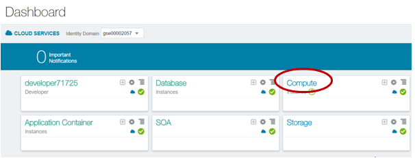

- From this page you can view general information about this Compute Cloud Service. **Click** on the **Open Service Console** button

    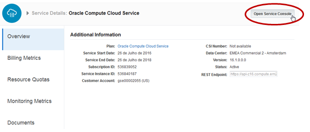

### **STEP 3:** Copy Public IP for Client Image
- The Compute Service Console will show you all running VM’s. Note: If a compute service is not visible, as shown below, the following task will provide instructions on how to change to the correct zone.

    

- Identity Domains will have multiple sites. Please ask you instructor which site the Client Image is running on. If needed, click the **Site** drop down to access the **Site Selector**, and choose the correct site.

    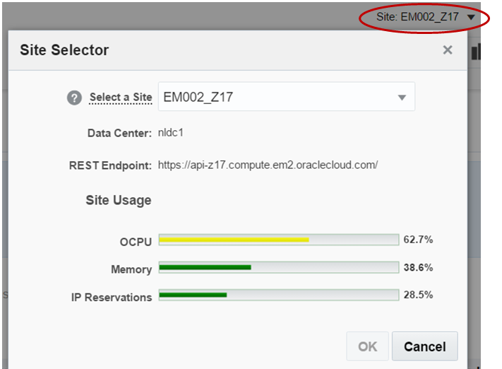

- Now that you have the correct site selected, find the instance name **ClientImage01** and copy down the **Public IP**

    

### **STEP 4:** Connect to Client Image using VNC Viewer
- If you do not already have a VNC Viewer installed on your computer, you will want to download a Viewer, or ask the instructor for the Real VNC Viewer executable. Run the VNC Viewer and enter the Public IP you just copied, by first appending either the display port **:443** or **:10**. Ask your instructor which port is active for this workshop. Next, click **Connect**.

    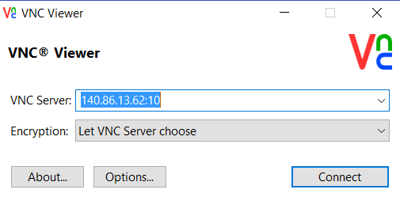

- Enter the password you used to log into the Oracle Cloud domain, and click **OK**.

    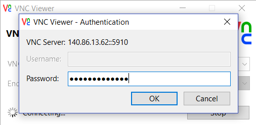

- You are now connected to the Client Image that will be used for all labs. You might want to place the image in full screen mode so that there is no confusion as to which environment you are working in. Note: the use of the compute “Client” image provides us the opportunity to simulate an on premises environment. We have pre-installed several tools within this compute Client image. Of course, you could install the same tools on your laptop to accomplish the same functionality provided by the Client Image, but to reduce the time required to complete the workshop, the Client Image just simplifies the configuration you’d be required to perform.

    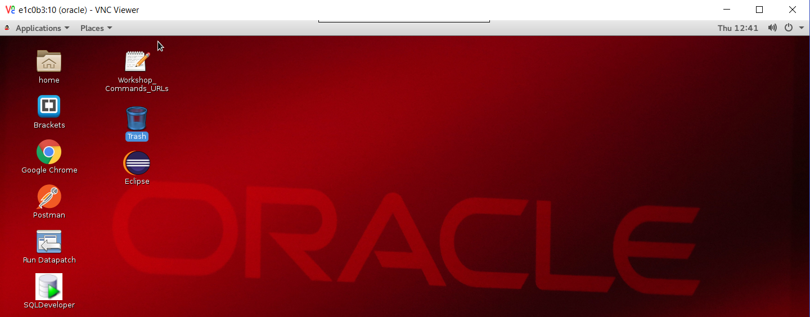

# Create Developer Cloud Service Project

## Create Developer Cloud Service Project

### **STEP 5:** Login to your Oracle Cloud Account
- From any browser, go to the URL:
    `https://cloud.oracle.com`

- click **Sign In** in the upper right hand corner of the browser

    

- **IMPORTANT** - Under my services, ***ask your instructor*** which **Region** to select from the drop down list, and click on the **My Services** button.

    

- Enter your identity domain and click **Go**.

    **NOTE:** The **Identity Domain, User Name** and **Password** values will be given to you by the instructor.

    

- Once you Identity Domain is set, enter your User Name and Password and click **Sign In**

    **NOTE:** For this lab you will assume the role of Project Manager ***Lisa Jones***. To make things simple we will be using a single login for all 3 roles.

    

- You will be presented with a Dashboard displaying the various cloud services available to this account.

    

- If all of your services are not visible, **click** on the **Customize Dashboard**, you can add services to the dashboard by clicking **Show.** If you do not want to see a specific service click **Hide**

    

### **STEP 6:** Login to Developer Cloud Service

Oracle Developer Cloud Service provides a complete development platform that streamlines team development processes and automates software delivery. The integrated platform includes an issue tracking system, agile development dashboards, code versioning and review platform, continuous integration and delivery automation, as well as team collaboration features such as wikis and live activity stream. With a rich web based dashboard and integration with popular development tools, Oracle Developer Cloud Service helps deliver better applications faster.

- From the Cloud UI dashboard click on the **Developer** service. In our example, the Developer Cloud Service is named **developer99019**.

    

- The Service Details page gives you a quick glance of the service status overview.

    

- Click **Open Service Console** for the Oracle Developer Cloud Service. The Service Console will list all projects for which you are currently a member.

    

### **STEP 7:** Create Developer Cloud Service Project

- Click **New Project** to start the project create wizard.
- On Details screen enter the following data and click on **Next**.

    **Name:** `Alpha Office Product Catalog`

    **Description:** `Alpha Office Product Catalog`

    **Note:** A Private project will only be seen by you. A Shared project will be seen by all Developer Cloud users. In either case, users need to be added to a project in order to interact with the project.

    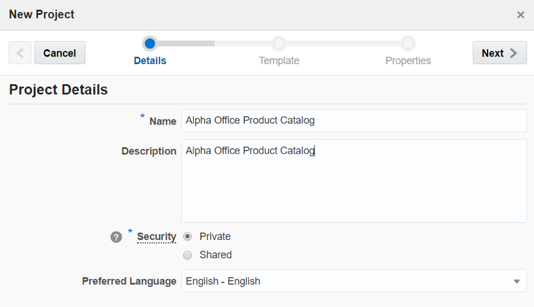

- Leave default template set to **Empty Project** and click **Next**

    

- Select your **Wiki Markup** preference to **MARKDOWN** and click **Finish**.

    

- The Project Creation will take about 1 minute.

    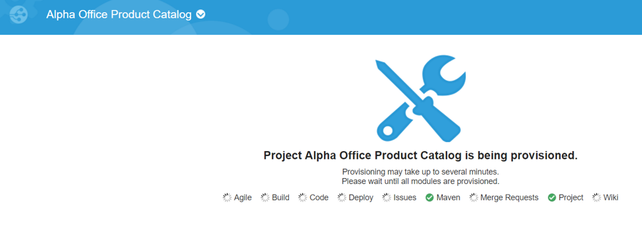

- You now have a new project, in which you can manage your software development.

    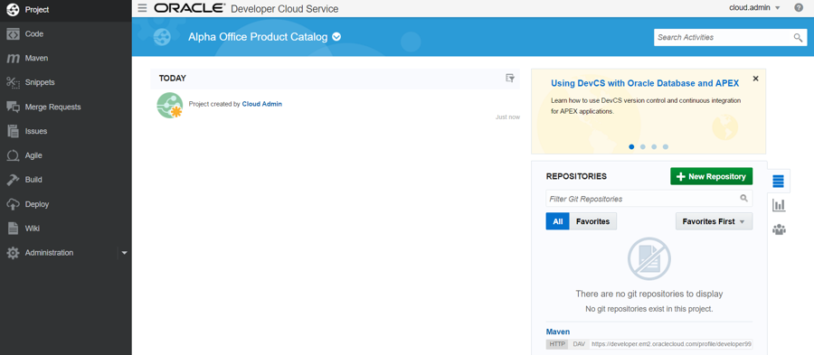

# Create Project Issues

## Create Issues for the Opperations Pipeline

In this step you are still connected in the logical role of the Project Manager, ***Lisa Jones***

### **STEP 8:** Create and Issue for the initial GIT Repository Creation

- Click **Issues** on left hand navigation panel to display the Track Issues page.

    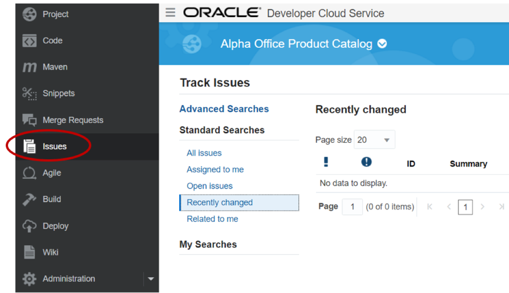

- Click **New Issue**. Enter the following data in the New Issue page and click **Create Issue**.

    **Note:** no matter who you assign as the task “physical” owner, for the sake of this workshop, Bala Gupta will be the “logical” owner.

    **Summary:** `Create Initial GIT Repository for Infrastructure and configure Build`

    **Description:** `Create Initial GIT Repository for Infrastructure and configure Build`

    **Type:** `Task`

    **Owner:** `Cloud Admin (or you, if another user is not available)`

    **Story Points:** `1`

Note: Story point is an arbitrary measure used by Scrum teams. This is used to measure the effort required to implement a story. To learn more, go to this URL:
https://agilefaq.wordpress.com/2007/11/13/what-is-a-story-point/

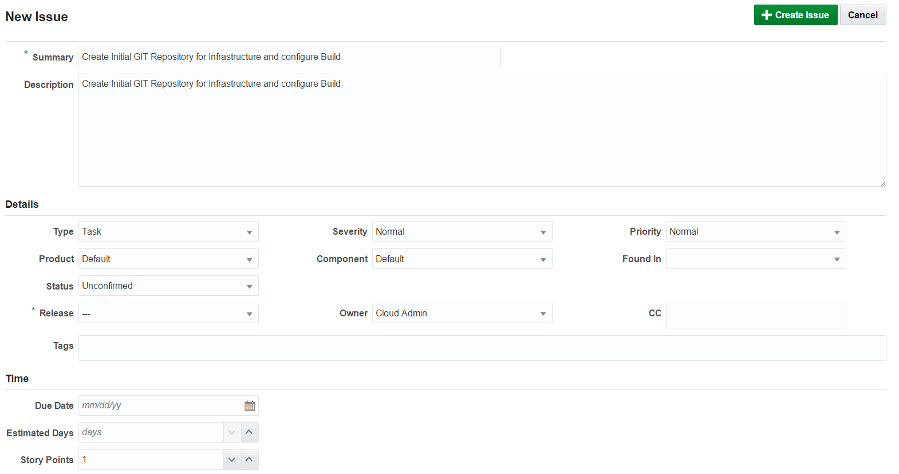

### **STEP 9:** Create Issue for Provision New Alpha Office Environment

- Click **New Issue**. Enter the following data in the New Issue page and click **Create Issue**.

    **Note:** no matter who you assign as the task “physical” owner, for the sake of this workshop, ***Bala Gupta*** will be the “logical” owner.

    **Summary:** `Provision new Alpha Office Environment`

    **Description:** `Provision new Alpha Office Environment by modifying configuration file`

    **Type:** `Task`

    **Owner:** `Cloud Admin (or you, if another user is not available)`

    **Story:**  `2`

    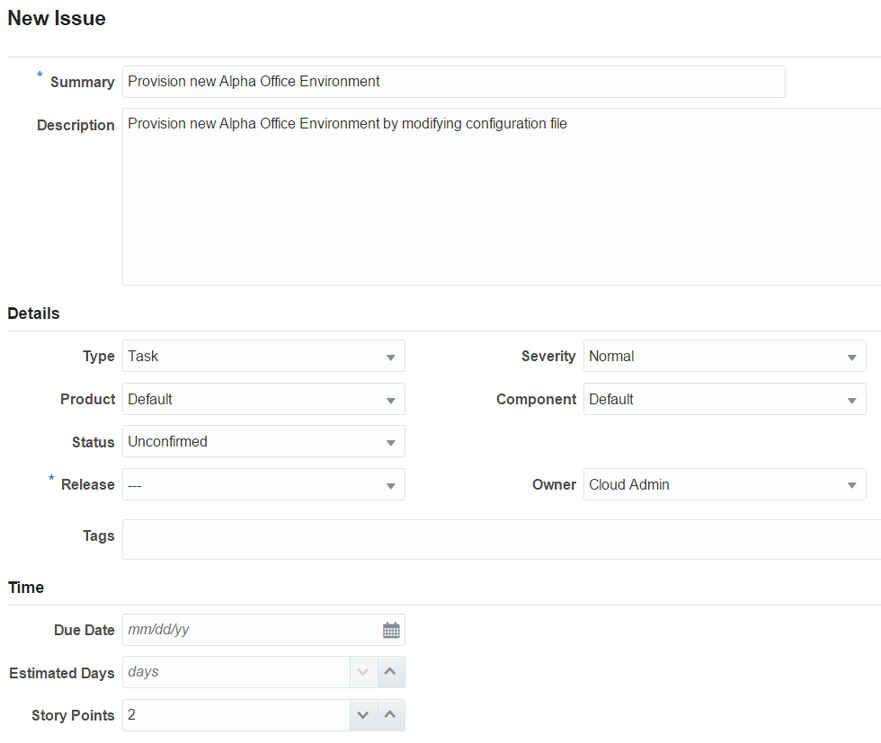

## Create Issues for Alpha Office UI

### **STEP 10:** Create Issue for initial GIT Repository creation and setup

- Click **New Issue**. Enter the following data in the New Issue page and click **Create Issue**.

    **Note:** no matter who you assign as the task “physical” owner, for the sake of this workshop, ***John Dunbar*** will be the “logical” owner.

    **Summary:** `Create Initial GIT Repository for Alpha Office UI`

    **Description:** `Create Initial GIT Repository for Alpha Office UI and setup Build and Deployment configuration`

    **Type:** `Task`

    **Owner:** `Cloud Admin (or you, if another user is not available)`

    **Story:**  `1`

    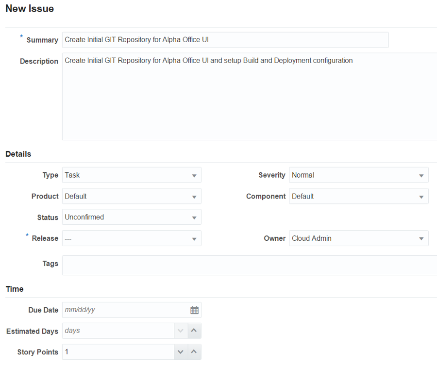

### **STEP 11:** Create Issue for Displaying Price

- Click **New Issue**. Enter the following data in the New Issue page and click **Create Issue**.

    **Note:** no matter who you assign as the task “physical” owner, for the sake of this workshop, ***John Dunbar*** will be the “logical” owner.

    **Summary:** `Add dollar sign in the display of the price`

    **Description:** `Add dollar sign in the display of the price`

    **Type:** `Defect`

    **Owner:** `Cloud Admin`

    **Story:**  `2`

    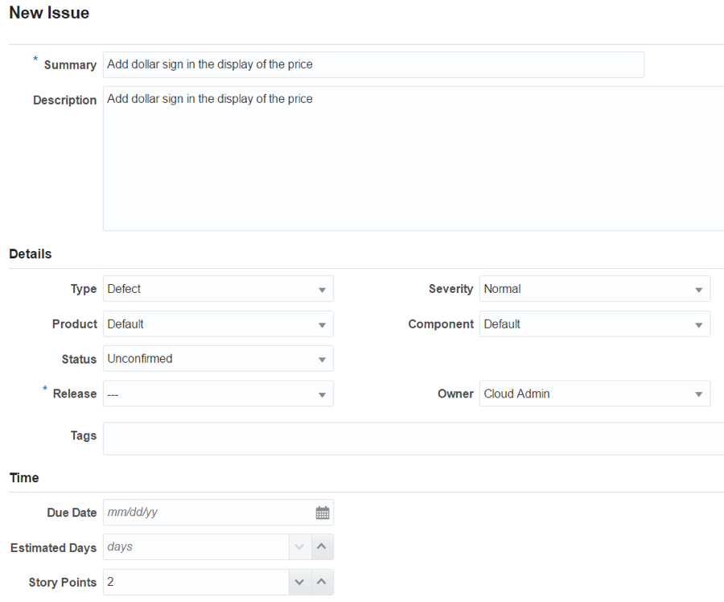

- Click the **<  Defect 4** on the **left** side of the window, or click on **Issues** menu option to view all newly created issues.

    

# Create Agile Board

## Create Agile Board and Initial Sprint

Before you start using the Agile methodology in Oracle Developer Cloud Service, it is important that you know the following key components of the Agile page.

- **Board** – A Board is used to display and update issues of the project. When you create a Board, you associate it with an Issue Query. The Board shows Issues returned by the Query.
You can either use a Board created by a team member, or create your own Board. You can create as many Boards as you like.
- **Sprint** – A Sprint is a short duration (usually, a week or two) during which your team members try to implement a product component.
You add the product component related issues to a Sprint. When you start working on a product component, you start (or activate) the related Sprints. To update issues using a Sprint, you must first activate the Sprint and add the Sprint to the Active Sprints view.
- **Backlog view** – Lists all Issues returned by the Board’s Query. The view also displays all active and inactive Sprints of the Board, and the sprints from other Boards that contain Issues matching the Board’s Query.
Each Sprint lists issues that are added to it. The Backlog section (the last section of the Backlog page) lists all open issues that are not part of any Sprint yet. The Backlog view does not show the resolved and closed Issues.
- **Active Sprints view** – Lists all active Sprints of the Board and enables you to update an Issue status simply by dragging and dropping it to the respective status columns.
- **Reports view** – select the Burndown Chart tab to display the amount of work left to do in a Sprint or use the Sprint Report tab to list open and completed Issues of a Sprint.

### **STEP 12:** Create Agile Board
- Click **Agile** on the Left Side Menu to display a page listing all existing Boards.

    

- Click **New Board** and enter the following data. When done click **Create**.

    **Name:** `AlphaOffice`

    **Estimation:** `Story Points`

    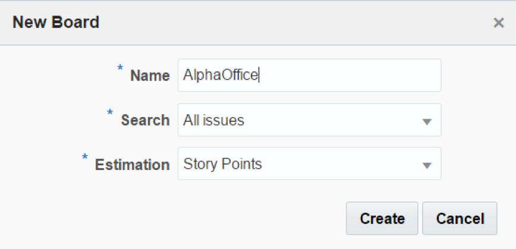

### **STEP 13:** Create Sprint

- We will now Create our first Sprint. Click **New Sprint**. Enter the following data and click **OK**.

    **Name:** `Sprint 1 - Initial development`

    **Story Points:** `6`

    

### **STEP 14:** Add Backlog Issues to Sprint

- Next we want to add the backlog issues to the newly created spring. **Drag and drop** the **4 issues** one at a time upward onto the **Sprint 1** section. This will add the issues to the sprint.

    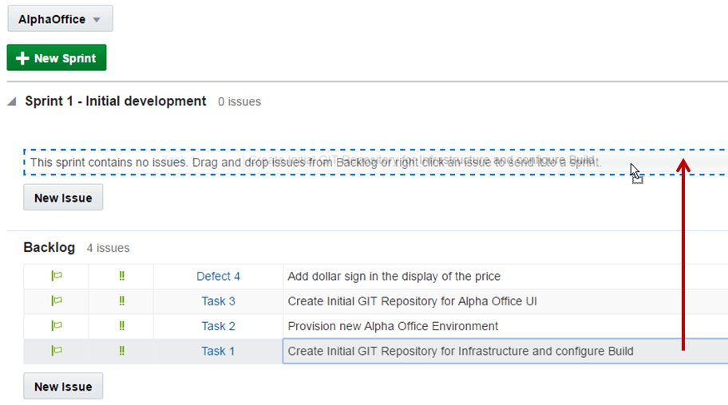

    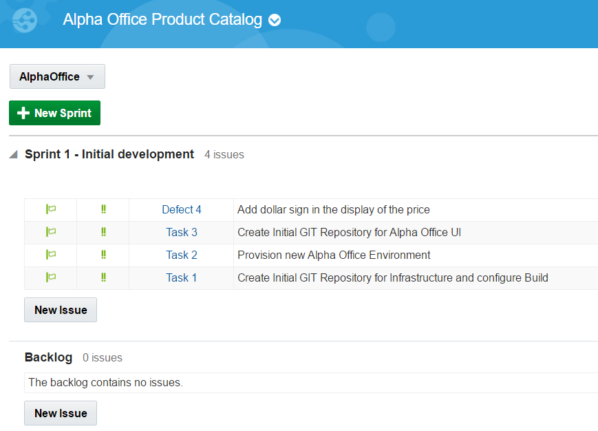

### **STEP 15:** View Active Sprint and Reports

- Click **Start Sprint.** Leave defaults and click **Start**

    

- Now click on **Active Sprints** to view the Sprint dashboard.

    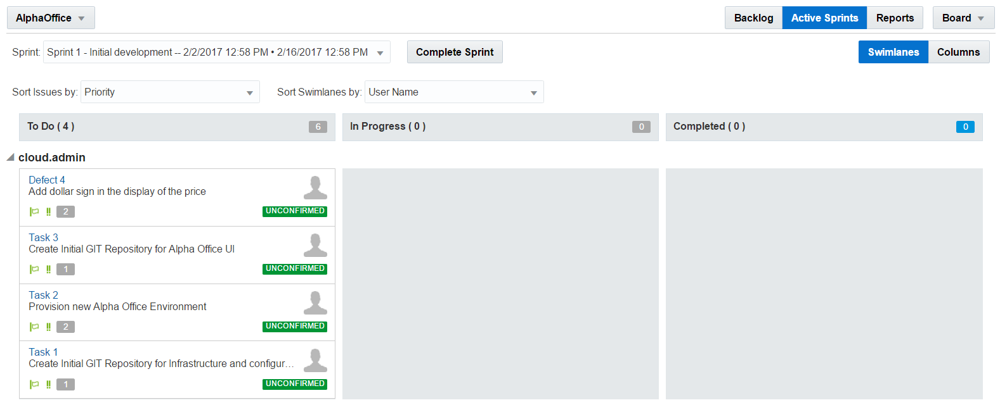

- Click on **Reports** button to view the Burndown Sprint reports.

    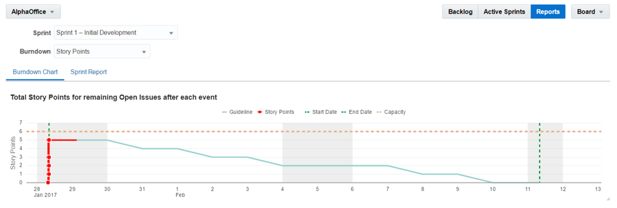

- You are now ready to move to the next lab.
